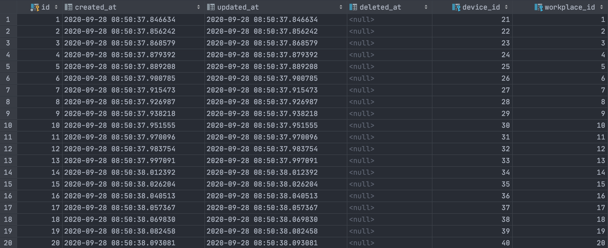

[](https://www.jetbrains.com/go/)
<br/>

[](https://github.com/petrjahoda/zapsi_demodata_service/commits/master)
[](https://github.com/petrjahoda/zapsi_demodata_service/issues)
<br/>


<br/>
[](https://hub.docker.com/r/petrjahoda/zapsi_demodata_service)
[](https://hub.docker.com/r/petrjahoda/zapsi_demodata_service/tags)
<br/>
[](https://www.postgresql.org) [](https://www.docker.com)

# Zapsi Demodata Service
## Description
Go service that generates pseudorandom data like "from Zapsi" devices and insert them to database.

## Installation Information
Install under docker runtime using [this dockerfile image](https://github.com/petrjahoda/system/tree/master/latest) with this command: ```docker-compose up -d```

## Implementation Information
Check the software running with this command: ```docker stats```. <br/>
Zapsi_demodata_service has to be running.


## Additional information
* creates 20 devices in ```device``` table
* creates device ports for those devices in ```device_ports``` table
* creates 20 workplaces in ```workplace``` table and link them with workshifts in ```workplace_workshifts``` table
* creates workplace ports in ```workplace_ports``` tables and link them with device ports
* creates 20 terminals ```device``` table and link them with workplaces in ```device_workplace``` table


Devices example


Device Workplaces example


Workplace Workshifts example


© 2020 Petr Jahoda
